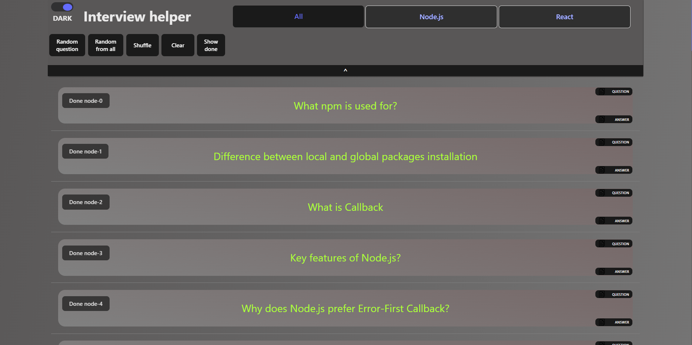

# Interview helper

An application that I'm building to help me to organize most of interview questions in one place



# Roadmap

- [x] hide / show head menu
- [] make QuestionsLegendHTMLElements for JSON (similar to simple markdown)
- [] store data from done questions
- [] simple pagination (or infinite scrolling)

# Instalation

```
git clone https://github.com/Darosss/Interview-helper.git
```

navigate to created folder

```
npm install
```

```
npm run dev
```
